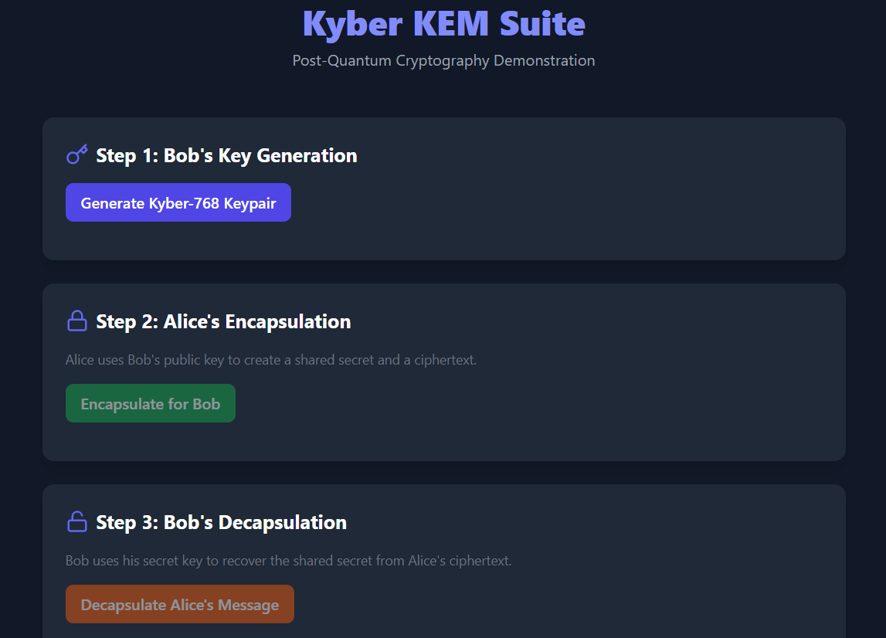

# Post-Quantum Cryptography Web Toolkit

An interactive web application for exploring post-quantum cryptography using CRYSTALS-Kyber, built with Rust and React.

## Overview

This project demonstrates the practical workflow of a post-quantum Key Encapsulation Mechanism (KEM) using the NIST-standardized CRYSTALS-Kyber algorithm.

The application allows users to:

* Generate Kyber keypairs
* Perform encapsulation
* Perform decapsulation
* Verify that two parties derive the same shared secret
* Visualize the complete Alice-Bob communication workflow through a web interface

The cryptographic operations are implemented in Rust using the pqcrypto ecosystem, while the frontend is built with React.

---

## Demo

### Web Interface




### Demo Video


```text
https://drive.google.com/file/d/13b1MeRVrWTf_HxLK7Xsqs1CtSZSQ3nAo/view?usp=drive_link
```

---

## Features

### Implemented

* CRYSTALS-Kyber KEM integration
* Kyber512 support
* Kyber768 support
* Kyber1024 support
* Key generation
* Encapsulation
* Decapsulation
* Shared secret verification
* Rust REST API backend
* React frontend dashboard
* Error handling and validation
* Example programs
* Integration tests

### Planned

* Dilithium digital signatures
* Falcon digital signatures
* SPHINCS+ signatures
* Benchmark visualizations
* WebAssembly support
* Performance comparison dashboard

---

## Architecture

```text
post-quantum-crypto-suite

├── rust/
│   └── pqc-rust/
│       ├── src/
│       │   ├── kem/
│       │   │   └── kyber.rs
│       │   ├── sig/
│       │   ├── config.rs
│       │   ├── errors.rs
│       │   └── lib.rs
│       │
│       └── src/bin/
│           └── server.rs
│
├── web-ui/
│   ├── src/
│   └── public/
│
├── docs/
├── benchmarks/
└── examples/
```

---

## Technology Stack

### Backend

* Rust
* Axum
* Tokio
* pqcrypto-kyber
* pqcrypto-traits
* Serde

### Frontend

* React
* Vite
* Axios
* Tailwind CSS
* Lucide React

### Tooling

* Cargo
* Git
* GitHub

---

## Running The Project

### Backend

```bash
cd rust/pqc-rust
cargo run --bin server
```

Backend runs on:

```text
http://localhost:8080
```

### Frontend

```bash
cd web-ui
npm install
npm run dev
```

Frontend runs on:

```text
http://localhost:5173
```

---

## Example Workflow

1. Generate Bob's keypair
2. Share Bob's public key with Alice
3. Alice encapsulates a shared secret
4. Alice sends ciphertext to Bob
5. Bob decapsulates the ciphertext
6. Both parties obtain the same shared secret

This demonstrates a complete post-quantum key establishment workflow.

---

## What I Learned

This project helped me gain hands-on experience with:

* Post-Quantum Cryptography
* CRYSTALS-Kyber
* Key Encapsulation Mechanisms (KEMs)
* Rust development
* REST API design
* React frontend development
* Frontend-backend integration
* Git and GitHub workflows
* Compiler-driven debugging

---

## Current Status

### Completed

* Rust architecture
* Kyber integration
* REST API backend
* React frontend
* End-to-end working demo

### In Progress

* Additional post-quantum algorithms
* Advanced visualizations
* Benchmarking dashboard

---

## Disclaimer

This project is intended for educational and demonstration purposes. Production cryptographic systems should always rely on thoroughly reviewed and audited implementations.
